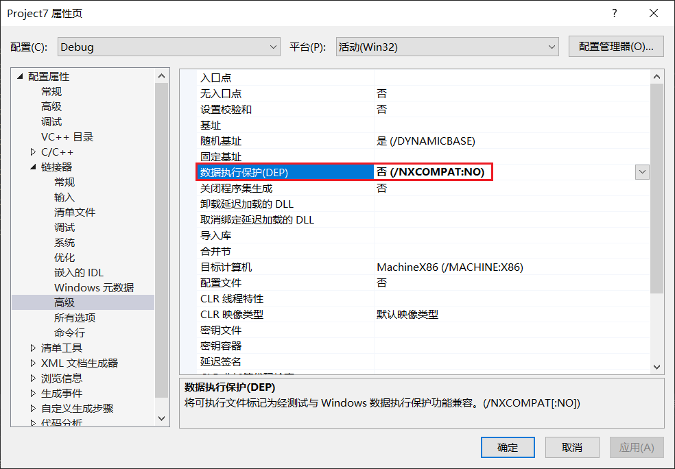
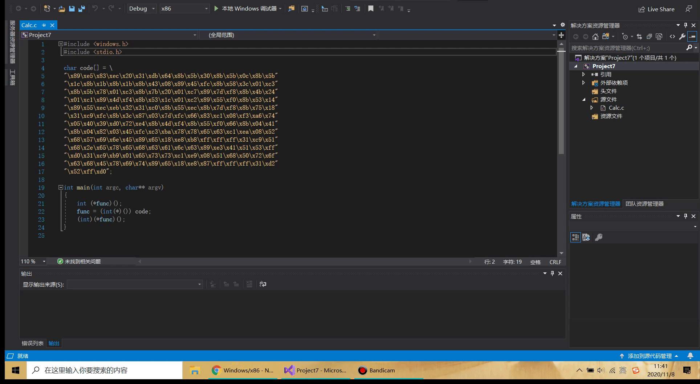
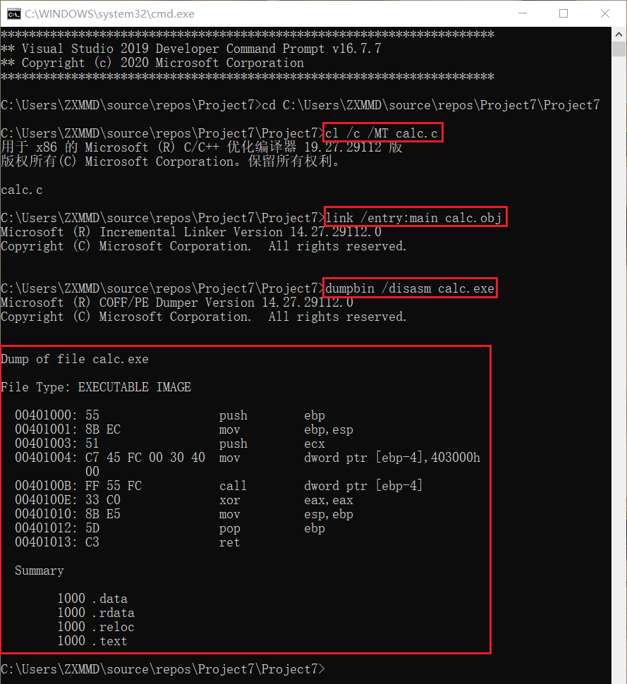
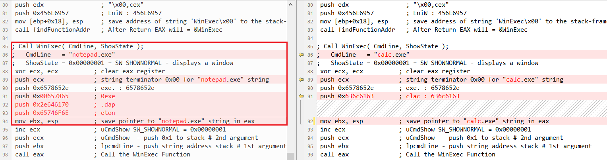
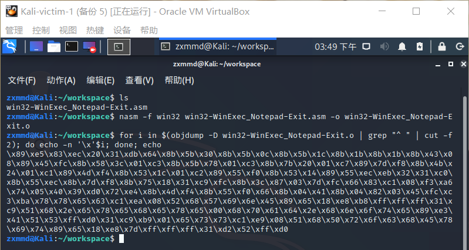
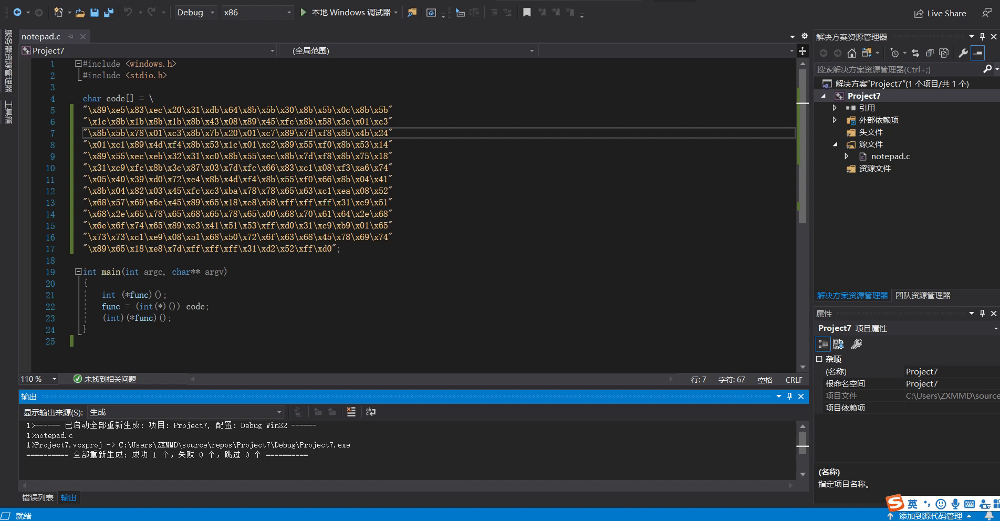

## 实验一 ：shellcode

### 实验要求

- [x] 把把[这个链接](https://www.exploit-db.com/shellcodes/48116)中的shellcode能够成功运行
- [x] 能从汇编源码编译通过并成功dump
- [x] 自行查阅资料，搜索Windows PEB结构体，PE文件导入表导出表相关数据结构的文档，解读shellcode原理
- [x] 修改shellcode功能为运行记事本程序notepad.exe

### 实验过程

#### 成功运行弹出计算器的shellcode

- 将扩展名由.cpp改为.c

- 关闭数据执行保护编译选项



- 运行结果



#### 编译通过并dump



#### shellcode原理


#### 修改shellcode弹出记事本

- 核心是将calc.exe修改为notepad.exe,参照[示例](https://www.exploit-db.com/shellcodes/48116),具体修改如下图所示：



- 将修改后的文件传到VirtualBox中的Kali系统中，执行如下命令,得到十六进制代码
```bash
nasm -f win32 win32-WinExec_Calc-Exit.asm -o win32-WinExec_Calc-Exit.o

for i in $(objdump -D win32-WinExec_Calc-Exit.o | grep "^ " | cut -f2); do echo -n '\x'$i; done; echo
```


- 运行结果

