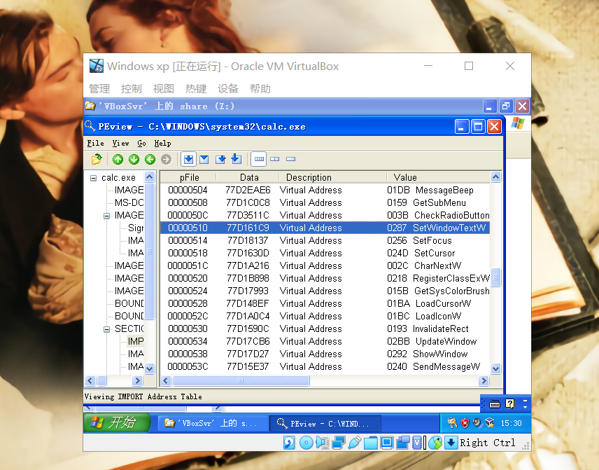
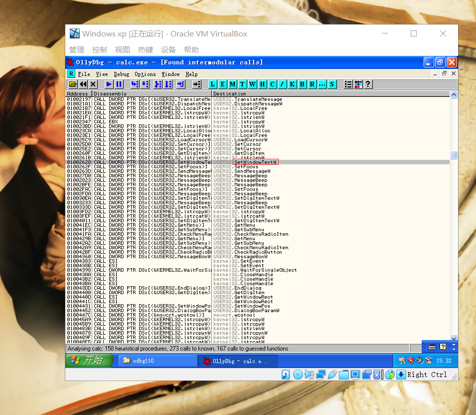
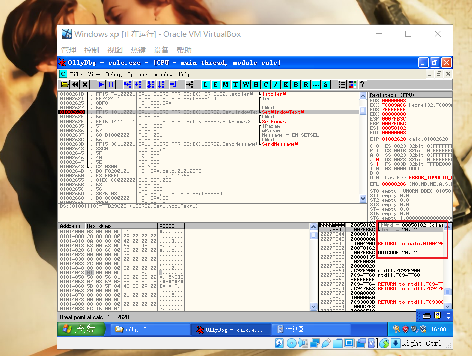
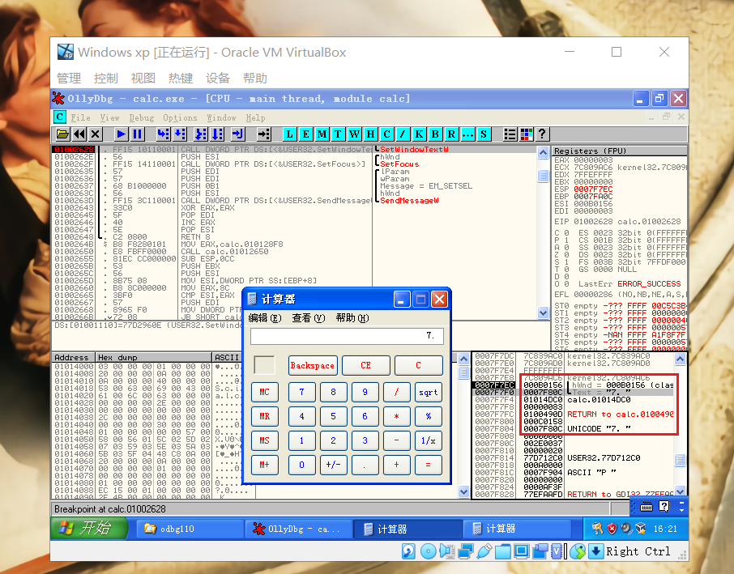
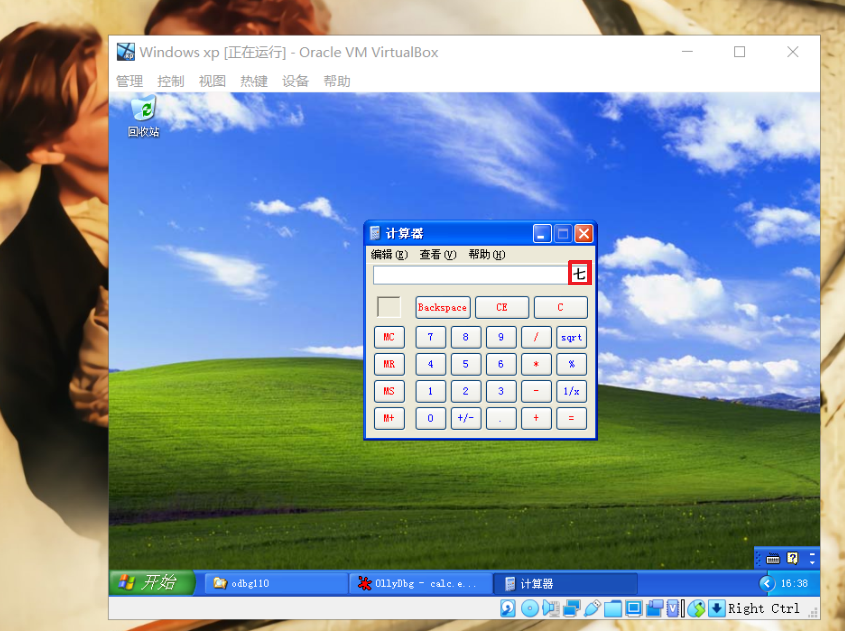
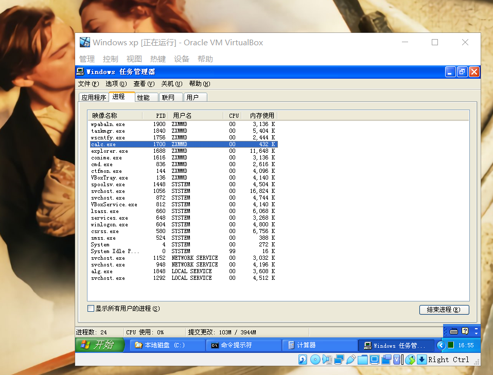
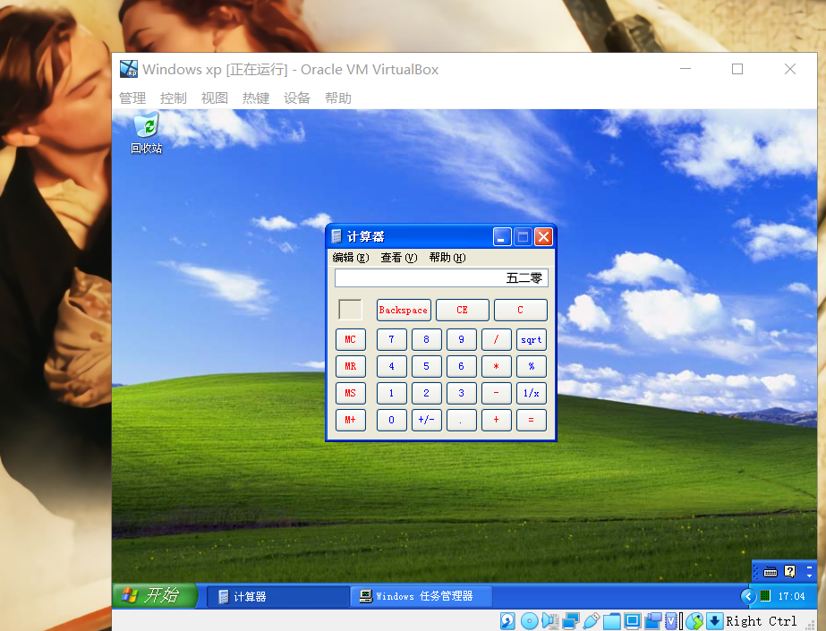
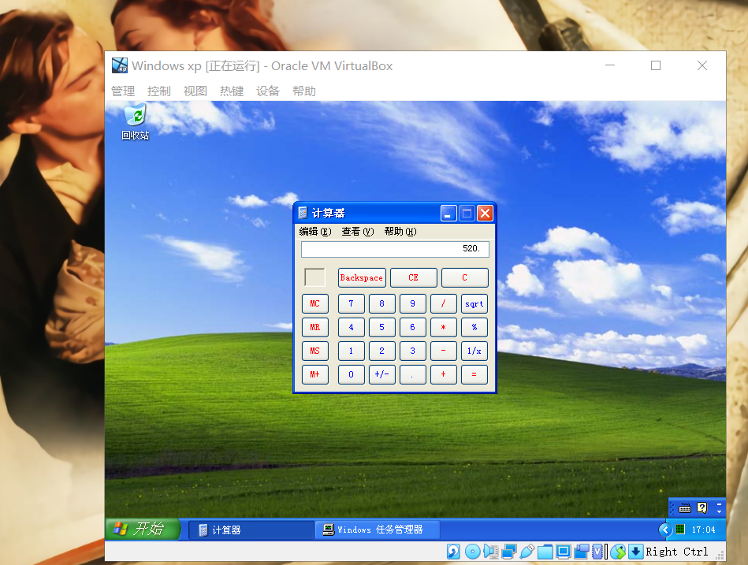

## 通过Dll注入实现IAT Hook

### 实验环境

- virtualbox
- Windows xp

### 目标: 计算器显示中文数字

- 向计算器进程注入`dll`文件,负责向计算器显示文本的函数被钩取之后,计算器中显示出的将是中文数字,而不是原来的阿拉伯数字。

### 选定目标API

- 使用`PEView`工具查看`calc.ece`导入的`API`,发现了`SetWindowTextW()`,它负责向计算器的文本显示框中显示文本,尝试`hook`这个`API`，看能不能达到目的。
  
  

### 分析目标API

- 在`MSDN`上查找`SetWindowText()`的定义如下

  ```bash
  # MSDN
  BOOLSetWindowText(   
      HWNDhWnd,   
      LPCTSTR lpString 
  );

  第一个参数为窗口句柄(hWnd),第二个参数为字符串指针(IpString),
  hook时查看字符串(IpString)中的内容,将其中的阿拉伯数字更改为中文就行了。
  ```

### 验证`hook`该`API`是否可行

- 使用`OllyDbg`工具进行调试。首先找到`SetWindowTextW()`,在所有调用它的地方设置断点。
  

- 查看栈窗口，可以看到`SetWindowTextW() API`的`lpString`参数的值为`7FB5C`，字符串`0.`被保存为Unicode码形式。
  

- 在计算器中输入7，调试器会在断点处暂停。保存在`Text`参数中的字符串地址为`7F80C`,可以看到输入的字符串`7.`
  

- 将中文数字“七”的Unicode码(4e03 )覆写到`7F80C`地址。覆写时要逆序进行,修改参数内容后,运行计算器,阿拉伯数字"7"变为了中文数字“七”
  

- 经过上述验证,我知道了只要修改`SetWindowTextW() API`参数字符串中的内容,就能修改计算器中显示的格式。
  
### 编写`IAThook.dll`的源代码

- 主要函数
   - `DllMain()`
   - `MyFunc()`
   - `hook_iat()`
  
#### DllMain()

  ```bash
  BOOL WINAPI DllMain(HINSTANCE hinstDLL, DWORD fdwReason, LPVOID lpvReserved)
  {
	switch (fdwReason)
	{
	case DLL_PROCESS_ATTACH: 
		g_pOrgFunc = GetProcAddress(GetModuleHandle(L"user32.dll"),
			"SetWindowTextW"); 
		hook_iat("user32.dll", g_pOrgFunc, (PROC)MyFunc);
		break;
	case DLL_PROCESS_DETACH:
		hook_iat("user32.dll", (PROC)MyFunc, g_pOrgFunc);
		break;
	}
	return TRUE;
  }

  # 在DLL_PROCESS_ATTACH时先获取SetWindowTextW() API的地址,
  # 然后将其保存到全局变量(g_pOrgFunc),“脱钩”时会用到这个地址。

  # hook_iat("user32.dll", g_pOrgFunc, (PROC)MyFunc;
  # 这条语句用来调用hook_iat()函数,将SetWindowTextW()的地址更改为MyFunc的地址

  # hook_iat("user32.dll", (PROC)MyFunc, g_pOrgFunc);
  # 这条语句是进行脱钩，将地址再改回来
  ```

#### MyFunc()

  ```bash
  BOOL WINAPI MyFunc(HWND hWnd, LPWSTR lpString)
  {
	wchar_t* pNum = L"零一二三四五六七八九";
	wchar_t temp[2] = { 0, };
	int i = 0, nLen = 0, nIndex = 0;

	nLen = wcslen(lpString);
	for (i = 0; i < nLen; i++)
	{
		if (L'0' <= lpString[i] && lpString[i] <= L'9')
		{
			temp[0] = lpString[i];
			nIndex = _wtoi(temp);
			lpString[i] = pNum[nIndex];
		}
	}
	return ((PFSETWINDOWTEXTW)g_pOrgFunc)(hWnd, lpString);
  }
  
  # calc.exe的IAT被hook后,每当代码中调用SetWindowTextWO函数时,都会首先调用MyFunc函数

  # MySetWindowTextW()函数的lpString参数是一块缓冲区,该缓冲区用来存放要输出显示的字符串
  # 操作lpString参数即可在计算器中显示指定的字符串。
  ```

#### hook_iat()

  ```bash
  BOOL hook_iat(LPCSTR szDllName, PROC pfnOrg, PROC pfnNew)
  {
	HMODULE hMod;
	LPCSTR szLibName;
	PIMAGE_IMPORT_DESCRIPTOR pImportDesc;
	PIMAGE_THUNK_DATA pThunk;
	DWORD dwOldProtect, dwRVA;
	PBYTE pAddr;

	hMod = GetModuleHandle(NULL);
	pAddr = (PBYTE)hMod;
	pAddr += *((DWORD*)&pAddr[0x3C]);
	dwRVA = *((DWORD*)&pAddr[0x80]);
	pImportDesc = (PIMAGE_IMPORT_DESCRIPTOR)((DWORD)hMod + dwRVA);

    # 上面这几行代码用来读取PE文件头信息,并查找IAT的位置。
    # 接下来使用for循环进行遍历比较，查找user32.dl1的IMAGEIMPORT DESCRIPTOR结构体地址。
    # 接下来进入user32的IAT, plmportDesc->FirstThunk成员所指的就是IAT。

	for (; pImportDesc->Name; pImportDesc++)
	{
		szLibName = (LPCSTR)((DWORD)hMod + pImportDesc->Name);
		if (!_stricmp(szLibName, szDllName))
		{
			pThunk = (PIMAGE_THUNK_DATA)((DWORD)hMod +
				pImportDesc->FirstThunk);

                  # 找到SetWindowTextW的IAT地址
			for (; pThunk->u1.Function; pThunk++)
			{
				if (pThunk->u1.Function == (DWORD)pfnOrg)
				{
					VirtualProtect((LPVOID)&pThunk->u1.Function,
						4,
						PAGE_EXECUTE_READWRITE,
						&dwOldProtect);

                                  # 找到后进行hook,修改地址
					pThunk->u1.Function = (DWORD)pfnNew;
					VirtualProtect((LPVOID)&pThunk->u1.Function,
						4,
						dwOldProtect,
						&dwOldProtect);
					return TRUE;
				}
			}
		}
	}
	return FALSE;
  }
  ```

### 对`calc.exe`进行`IAT hook`

- 在网上找到了进行`DLL注入`的源代码，编译成`InjectDll.exe`方便使用
- 查看`calc.exe`运行时的`PID`

  

- 在命令行中输`InjectDll.exe i 1700 D:\IAThook.dll`进行`DLL注入`
  
  

- 在命令行中输`InjectDll.exe e 1700 D:\IAThook.dll`卸载注入的`dll`

  

### 参考

- [李承远《逆向工程核心原理》](https://blog.csdn.net/bangren3304/article/details/101078611?utm_medium=distribute.pc_relevant.none-task-blog-title-6&spm=1001.2101.3001.4242)
- [Dll注入和卸载](https://www.52pojie.cn/thread-1142368-1-1.html)
- [IAT hook](https://blog.csdn.net/enjoy5512/article/details/51570116)
- [hook技术--IAT hook](https://www.cnblogs.com/freesec/p/6558848.html)
- [简单通过修改IAT HOOK API函数_late0001_新浪博客](http://blog.sina.com.cn/s/blog_af35592a0102vcky.html)
- [dll注入实现IAT勾取-计算器显示中文](https://www.cnblogs.com/hanhandaren/p/11499073.html)